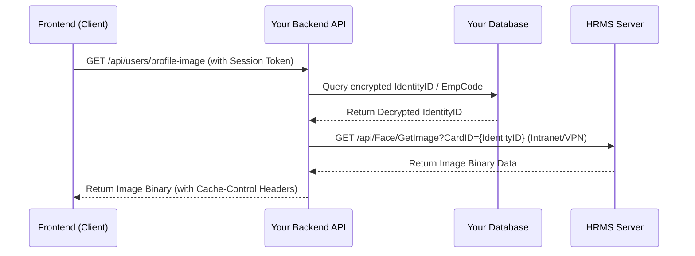

# คู่มือการเชื่อมต่อ HRMS เพื่อแสดงรูปภาพโปรไฟล์พนักงาน (HRMS Image Integration Guide)

คู่มือนี้จัดทำขึ้นเพื่อเป็นแนวทางในการเชื่อมต่อระบบ HRMS เพื่อดึงข้อมูลรูปภาพโปรไฟล์ของพนักงานมาแสดงผลบนระบบอื่น ๆ ในองค์กร โดยให้ความสำคัญกับ **ประสิทธิภาพการทำงาน (Performance)** และ **ความปลอดภัยของข้อมูลส่วนบุคคล (PII Security)**

---

## 1. ข้อมูล API ปลายทาง (HRMS API Endpoint)

ระบบ HRMS ให้บริการ API สำหรับดึงรูปภาพใบหน้าของพนักงานโดยใช้ **เลขบัตรประจำตัวประชาชน (IdentityID/CardID)** เป็น Key ในการเรียกค้น:

*   **URL Format:** `https://wms.advanceagro.net/WSVIS/api/Face/GetImage?CardID={IdentityID}`
*   **Method:** `GET`
*   **Response:** File stream (รูปภาพโดยตรง เช่น JPEG/PNG)

---

## 2. ข้อควรระวังด้านความปลอดภัย (Security & PII Compliance)

> [!WARNING]
> **ข้อมูล IdentityID (เลขบัตรประชาชน) เป็นข้อมูลส่วนบุคคลที่มีความอ่อนไหวสูง (Sensitive PII)**
> *   **ห้าม** เก็บ `IdentityID` เป็น Plain Text ในฐานข้อมูลของระบบปลายทางที่ใช้แบบสอบถามหรือแสดงผลทั่วไป
> *   **ห้าม** ส่ง `IdentityID` ไปกับ API Response หรือแสดงใน URL ของรูปภาพทางฝั่ง Frontend (ในหน้าจอ Network tab ของบราวเซอร์) เพื่อป้องกันการโจรกรรมข้อมูล

---

## 3. รูปแบบการสถาปัตยกรรมและทางเลือกในการเชื่อมต่อ (Implementation Approaches)

มี 2 แนวทางหลักในการนำไปใช้งาน ขึ้นอยู่กับข้อกำหนดด้านความปลอดภัยและโครงสร้างของโปรเจคใหม่:

### วิธีที่ 1: Secure Backend Proxy (แนะนำสูงสุด ⭐⭐⭐)
สร้าง Proxy Endpoint บน Backend ของคุณเพื่อไปดึงภาพจาก HRMS มาส่งต่อให้ Frontend วิธีนี้ปลอดภัยที่สุดเนื่องจากไม่มีการเปิดเผย URL ตรงและ `IdentityID` ให้ภายนอกเห็น



**ข้อดี:**
* ปลอดภัย 100% บราวเซอร์ภายนอกไม่เห็นเลขบัตรประชาชน
* สามารถจัดการ Cache ของรูปภาพได้ที่ฝั่ง Backend ของตัวเอง เพื่อลด Load ของเซิร์ฟเวอร์ HRMS
* ทำงานหลัง Firewall / VPN ได้ดีกว่า

---

### วิธีที่ 2: Database Pre-composed URL (สำหรับระบบปิด/ระบบภายในที่ควบคุมเครื่อง Client ได้)
แปลงและประกอบ URL สำเร็จรูปจากฝั่ง Backend แล้วจัดเก็บลงในฐานข้อมูลฟิลด์ `avatar_url` ก่อนจะส่งไปให้ Frontend แสดงผลโดยตรง

**ข้อดี:** พัฒนาง่าย ไม่ต้องมี Endpoint มารับหน้าที่ Proxy
**ข้อเสีย:** ยังมีโอกาสที่ผู้ใช้สามารถสแกน HTML Source เพื่อดูเลขบัตรประชาชนจากตัวแปร URL ได้

---

## 4. ตัวอย่างการพัฒนาโค้ด (Code Examples)

### 4.1 ตัวอย่าง Backend Proxy (Node.js / Express)

ตัวอย่างโค้ด Backend ในการทำ Proxy ดึงรูปภาพ เพื่อไม่ให้ฝั่ง Frontend เห็น `IdentityID`:

```javascript
const express = require('express');
const axios = require('axios');
const router = express.Router();

// สมมติว่ามีฟังก์ชันถอดรหัส หรือดึงข้อมูลผู้ใช้จาก Session/Database
const { getEmployeeIdentityId } = require('./db-helper'); 

router.get('/api/employee/avatar', async (req, res) => {
  try {
    // 1. ตรวจสอบสิทธิ์ผู้ใช้งาน (Authentication)
    if (!req.user) {
      return res.status(401).json({ error: 'Unauthorized' });
    }

    // 2. ดึง IdentityID ของพนักงาน (แนะนำให้เก็บแบบ Encrypted ใน DB และถอดรหัสในขั้นตอนนี้)
    const empId = req.user.employee_code;
    const identityId = await getEmployeeIdentityId(empId); 

    if (!identityId) {
      return res.status(404).json({ error: 'Avatar not found (No Identity ID)' });
    }

    // 3. เรียกขอรูปภาพจาก HRMS API 
    const hrmsUrl = `https://wms.advanceagro.net/WSVIS/api/Face/GetImage?CardID=${identityId}`;
    
    const response = await axios({
      method: 'get',
      url: hrmsUrl,
      responseType: 'stream',
      timeout: 5000 // กำหนด timeout ป้องกันการค้าง
    });

    // 4. ส่ง Headers สำหรับการแคช เพื่อไม่ให้บราวเซอร์ต้องยิงขอรูปภาพบ่อยๆ
    res.setHeader('Content-Type', response.headers['content-type'] || 'image/jpeg');
    res.setHeader('Cache-Control', 'public, max-age=86400'); // Cache 1 วัน

    // 5. Pipe ข้อมูลรูปภาพกลับไปให้ Client
    response.data.pipe(res);

  } catch (error) {
    console.error('Failed to fetch avatar from HRMS:', error.message);
    // กรณีหาไม่เจอ หรือระบบล่ม ให้ส่งรูป Default Avatar กลับไป
    res.redirect('/images/default-avatar.png');
  }
});

module.exports = router;
```

---

### 4.2 ตัวอย่าง Component ฝั่ง Frontend (React + Tailwind CSS)

สร้าง Component สำหรับแสดงรูปโปรไฟล์พนักงานที่ยืดหยุ่น รองรับการโหลดล้มเหลว (Fallback) และนำตัวอักษรแรกของชื่อมาแสดงแทนหากไม่มีรูปภาพ

```tsx
import React, { useState } from 'react';
import { User } from 'lucide-react'; // หรือใช้ไอคอนที่มีในโปรเจค

interface EmployeeAvatarProps {
  src?: string;          // URL ของรูปภาพโปรไฟล์ (เช่น /api/employee/avatar หรือ direct URL)
  nameEn: string;        // ชื่อภาษาอังกฤษ (เช่น "Yuparate Chiewkul")
  size?: 'sm' | 'md' | 'lg' | 'xl';
  className?: string;
}

export const EmployeeAvatar: React.FC<EmployeeAvatarProps> = ({
  src,
  nameEn,
  size = 'md',
  className = '',
}) => {
  const [hasError, setHasError] = useState(false);

  // คำนวณหา Initials จากชื่อ เช่น "Yuparate Chiewkul" -> "YC"
  const getInitials = (fullName: string) => {
    if (!fullName) return '?';
    const parts = fullName.trim().split(' ');
    if (parts.length >= 2) {
      return `${parts[0][0]}${parts[1][0]}`.toUpperCase();
    }
    return parts[0][0].toUpperCase();
  };

  // กำหนดขนาดแสดงผล
  const sizeClasses = {
    sm: 'w-8 h-8 text-xs',
    md: 'w-10 h-10 text-sm',
    lg: 'w-16 h-16 text-xl font-semibold',
    xl: 'w-24 h-24 text-3xl font-semibold',
  };

  const hasImage = src && !hasError;

  return (
    <div
      className={`relative flex items-center justify-center rounded-full overflow-hidden select-none bg-slate-100 border border-slate-200 text-slate-600 ${sizeClasses[size]} ${className}`}
    >
      {hasImage ? (
         setHasError(true)}
          loading="lazy"
        />
      ) : (
        // Fallback: แสดง Initials ของพนักงานเมื่อไม่มีรูปภาพ หรือโหลดรูปภาพไม่สำเร็จ
        <div className="flex items-center justify-center w-full h-full bg-gradient-to-br from-indigo-500 to-purple-600 text-white font-medium">
          {nameEn ? getInitials(nameEn) : <User className="w-1/2 h-1/2" />}
        </div>
      )}
    </div>
  );
};
```

---

## 5. การจัดการ Error และประสิทธิภาพ (Best Practices)

1.  **Lazy Loading:** ควรระบุ `loading="lazy"` เสมอในแท็ก `` เพื่อไม่ให้บราวเซอร์ดาวน์โหลดรูปภาพที่ยังไม่ถูกเลื่อนมาเห็น (ลด Network Bandwidth ของเครื่อง Client)
2.  **Fallback Implementation:** ต้องมีรูปภาพ Default หรือระบบแสดงผลตัวย่อชื่อพนักงาน (Initials) เสมอ เพื่อรับมือกับกรณีที่:
    *   พนักงานเข้าใหม่ยังไม่มีรูปถ่ายในระบบ HRMS
    *   API ของ HRMS ตอบกลับช้า หรือเข้าถึงไม่ได้ (เช่น พนักงานเข้างานนอก VPN)
3.  **Caching Header:** เนื่องจากรูปโปรไฟล์พนักงานไม่มีการเปลี่ยนบ่อย ๆ ควรตั้งค่า HTTP Headers `Cache-Control: public, max-age=86400` (แคช 24 ชั่วโมง) ที่ฝั่งเซิร์ฟเวอร์ proxy เพื่อช่วยให้โหลดรูปภาพได้รวดเร็วขึ้นเมื่อพนักงานเปลี่ยนหน้าเว็บ
4.  **Network Firewall / VPN:** หากโปรเจคใหม่รันอยู่บน Cloud Server ภายนอก (เช่น AWS/Vercel) แต่ระบบ HRMS ทำงานอยู่ภายใน VPN/Intranet องค์กร จำเป็นต้องมีการตั้งค่าเชื่อมต่อ VPN Tunnel หรือ IP Whitelisting ระหว่าง Server ของคุณกับเครื่องโฮสต์ `wms.advanceagro.net` เสมอ
